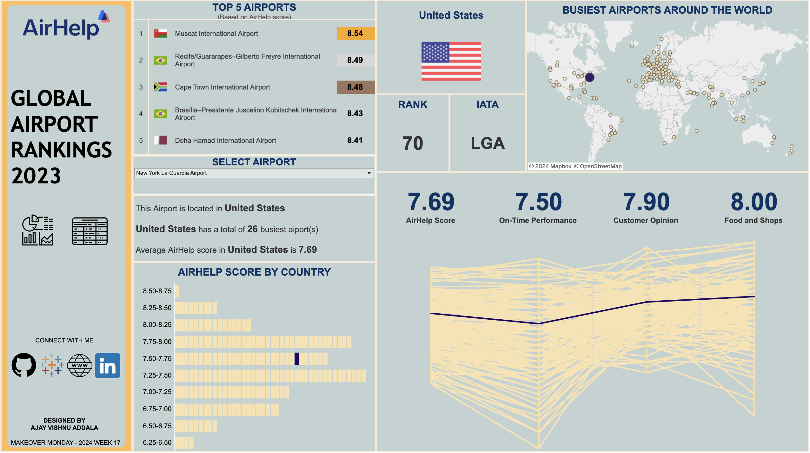

# Global Airport Rankings 2023 Dashboard

This project is part of the Makeover Monday challenge and focuses on visualizing the rankings of the busiest airports in the world for the year 2023. The dashboard is created using Tableau and provides interactive insights into various metrics related to airport performance and customer satisfaction.

## Dashboard Overview

The dashboard includes the following visualizations:

1. **Parallel Coordinates Plot**: Visualizes the Airhelp Score, On-Time Performance, Customer Opinion, Food, and Stores metrics for selected airports.
2. **World Map**: Displays the locations of airports ranked in 2023.
3. **Country of the Airport**: Shows the country of each selected airport.
4. **Rank of the Airport**: Displays the rank of each airport.
5. **IATA Code**: Shows the IATA code for each airport.
6. **Airhelp Score Range Bar Chart**: Illustrates the distribution of Airhelp scores across airports.
7. **Country Stats**: Provides statistics about the country of the selected airport.

Users can select a specific airport from the dropdown menu, which dynamically updates all visualizations to highlight the selected airport's data.

Additionally, a table view of the data is available for users who prefer a more structured representation.

## Files Included

- **Excel File**: Contains the dataset used for the analysis.
- **Snapshot**: Snapshot image of the Tableau dashboard.
- **Tableau File**: Tableau workbook file containing the dashboard and visualizations.

## Snapshot

## Tableau Public Link

[Link to Tableau Public Dashboard](https://public.tableau.com/views/GlobalAirportRankingsAirHelpMOM2024Week17/AirHelp_Analysis?:language=en-US&:sid=&:display_count=n&:origin=viz_share_link)

## Usage

To explore the dashboard:

1. Download the Tableau file and open it in Tableau Desktop.
2. Alternatively, access the dashboard directly via the Tableau Public link provided above.
3. Select an airport from the dropdown menu to view detailed insights and analysis.

